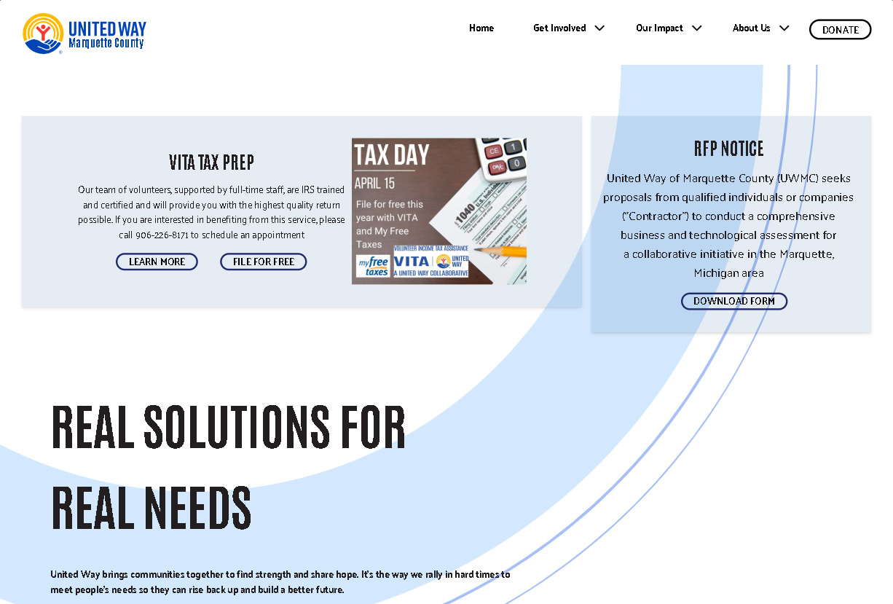

# United Way of Marquette Michigan Astro App

[]

## Description

This application serves as the informational website for the United Way of Marquette County. It provides, much like the UW does for proper allocation of donations, a funnel to direct users to the programs and services offered in their community.

## Table of Contents

⋆[Installation](#Installation)
⋆[Usage](#Usage)
⋆[Credits](#Credits)
⋆[License](#License)
⋆[Features](#Features)
⋆[Contributions](#Contributions)
⋆[Test](#Contributions)

## Installation

This application requires private dependencies and API's, it is not recommended to run this app locally. Please visit the website to demo it.

## Usage

This application is to be used in any modern web browser.

## Credits

Brahm Van Houzen

## License

(https://opensource.org/licenses/MIT)

## Features

- Astro content collections
- dynamically loaded images and content from headless WordPress CMS
- Custom WP Page to Markdown Content functionality
- Data caching with Redis
- Custom Stripe integration for one-time and monthly donations

  ## Technologies

- Astro
- React
- TailwindCSS
- GraphQL
- ShadCN
- TypeScript
- Stripe

  ## Contributions

  Please consider making a donation to myself at [brahmvanhouzen.studio](https://brahmvanhouzen.studio) or directly to the United Way of Marquette Michigan at [uwmqt.org](https://uwmqt.org/donate)

  ## Test

  ## Questions

  If you have any questions about the project you can reach out to me via email or GitHub with the information below.

  > Email: brahmvanh@gmail.com

  > GitHub: [brahmvanh](https://github.com/brahmvanh)
